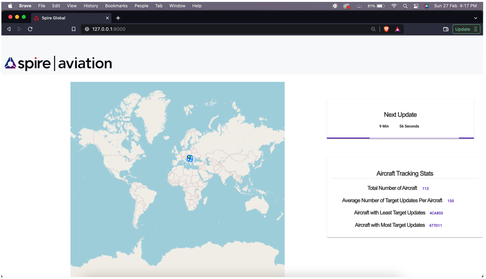
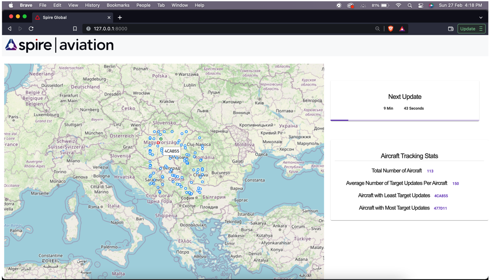

# spire-aircraft-tracking-app

**Use case**

Connect to Spire’s AirSafe Tracking Stream API. Read the data for at least 10 minutes and perform the following processing steps:

● Create a positional density map with resolution 0.1x0.1 deg. Use fields latitude and longitude to determine the position of the aircraft. Suggest an appropriate way of presenting the map.

● Analyze number of target updates per aircraft (identified by icao_address field). Report the number of aircraft in the data sample, average number of target updates per aircraft and aircraft with smallest and biggest number of target updates.

The above image shows pins which indicate the current position of aircraft in the map. The blue coloured pins are aircraft with normal target updates. The red coloured pins are with least target updates and green with most target updates

**Framework Used**

•	Django 4.0.3 (Backend) – Python 3.10

•	Angular 13 (Frontend) – Typescript, SCSS, HTML

Database: SQLite 3

**How to Run the App?**

Please install the below prerequisites for macOS to run application

Requirements: 
•	Python 3.10.0
•	Node v16.13.0
•	NPM 8.1.0

1. Extract the folder named “spire_app”.

2. Go to folder “spire_app” ,Run “python3 -m venv djangoenv”  and “source djangoenv/bin/activate” to activate virtual environment or use “source env/bin/activate” to activate the existing env inside folder
3. Go inside folder airsafeTracking
4. Execute the following commands if you are using your own virtual environment otherwise no need go to step 5
    3.1 “pip install -r requirements.txt” to install all dependencies.
    3.2 “python manage.py makemigrations”  and “python manage.py migrate ”to make   database migration

5. After executing the above commands run “python3 manage.py runserver” to start the application. Access application  at http://127.0.0.1:8000/ 
	
**Workflow**

User can go to the website to view the last 10 minutes Aircraft  Target Updates. A countdown timer is shown  in UI which indicate how long user needs to wait to get the last 10 minutes processed target updates of aircraft from current time . The UI shows the below aircraft stats by analysing the target updates

•	A positional density map showing the position of the aircraft.
•	Total number of aircraft data processed in last 10 mins.
•Average number of target updates sent per  aircraft
•	Aircraft with least number of target updates
•	Aircraft with most number of target updates

**Backend Workflow**

•	An aircraft model is used to store “icao_address”, longitude and latitude of aircraft. 

•	Spire’s AirSafe Tracking Stream API is used to get the target updates of aircraft every 10 minutes. 

•	Position token is used to get the continuous target updates from stream to avoid losing any messages 

•	Django’s database cache mechanism is used to store position token , last data sync time and updates available value to get latest updates.

**REST API Request & Response**

GET: http://127.0.0.1:8000/v1/targets/aircrafts

{
    "updates_available": true,
    "next_update": "2022-02-27T11:36:59.344537+00:00",
    "details": {
        "total_number_of_aircrafts": 80,
        "aircraft_details": [
            {
                "name": "01010D",
                "lat": "46.647675",
                "lon": "20.330468"
            },
            {
                "name": "456043",
                "lat": "43.133348",
                "lon": "23.118766"
            },
            {
                "name": "471F5F",
                "lat": "46.731929",
                "lon": "19.201286"
            },
            {
                "name": "06A07A",
                "lat": "46.586517",
                "lon": "22.987619"
            },
            {
                "name": "76CEFA",
                "lat": "44.643356",
                "lon": "19.897744"
            },
            {
                "name": "0101BB",
                "lat": "43.492825",
                "lon": "21.789485"
            },
            {
                "name": "896533",
                "lat": "46.264481",
                "lon": "19.532419"
            },
            {
                "name": "471F67",
                "lat": "43.084655",
                "lon": "23.206068"
            },
            {
                "name": "407BF5",
                "lat": "45.466453",
                "lon": "18.506068"
            },
            {
                "name": "4A068B",
                "lat": "45.919174",
                "lon": "21.095810"
            },
            {
                "name": "010209",
                "lat": "44.970951",
                "lon": "20.066997"
            },
            {
                "name": "4BB06B",
                "lat": "47.423309",
                "lon": "19.334770"
            },
            {
                "name": "406CAA",
                "lat": "44.762909",
                "lon": "19.625199"
            },
            {
                "name": "4BA903",
                "lat": "47.555649",
                "lon": "18.414391"
            },
            {
                "name": "44B438",
                "lat": "44.445796",
                "lon": "23.430957"
            },
            {
                "name": "4401D7",
                "lat": "47.303558",
                "lon": "18.779411"
            },
            {
                "name": "48AD82",
                "lat": "47.784348",
                "lon": "19.617668"
            },
            {
                "name": "471F35",
                "lat": "47.188705",
                "lon": "23.213837"
            },
            {
                "name": "8964B2",
                "lat": "46.232620",
                "lon": "20.213437"
            },
            {
                "name": "40666C",
                "lat": "45.669159",
                "lon": "19.391740"
            },
            {
                "name": "3C65CB",
                "lat": "43.462692",
                "lon": "21.817890"
            },
            {
                "name": "3C6597",
                "lat": "45.891894",
                "lon": "19.892944"
            },
            {
                "name": "4B8D87",
                "lat": "43.526296",
                "lon": "23.474513"
            },
            {
                "name": "51200F",
                "lat": "43.855467",
                "lon": "21.063865"
            },
            {
                "name": "8964B4",
                "lat": "46.212479",
                "lon": "23.229452"
            },
            {
                "name": "4C01E2",
                "lat": "44.206192",
                "lon": "20.827397"
            },
            {
                "name": "4BAB56",
                "lat": "45.363876",
                "lon": "22.747977"
            },
            {
                "name": "471F8F",
                "lat": "43.980743",
                "lon": "19.473969"
            },
            {
                "name": "4BC841",
                "lat": "43.451569",
                "lon": "22.421435"
            },
            {
                "name": "48CA40",
                "lat": "44.096002",
                "lon": "22.110901"
            },
            {
                "name": "4520CE",
                "lat": "44.737152",
                "lon": "20.428619"
            },
            {
                "name": "48AE25",
                "lat": "43.180785",
                "lon": "23.102482"
            },
            {
                "name": "06A0EB",
                "lat": "46.026352",
                "lon": "18.763443"
            },
            {
                "name": "407574",
                "lat": "43.377228",
                "lon": "18.475746"
            },
            {
                "name": "4BAB5A",
                "lat": "46.942886",
                "lon": "18.001167"
            },
            {
                "name": "3C6657",
                "lat": "43.047692",
                "lon": "22.517395"
            },
            {
                "name": "3C4DCD",
                "lat": "44.988688",
                "lon": "19.893628"
            },
            {
                "name": "44061D",
                "lat": "45.362363",
                "lon": "20.701659"
            },
            {
                "name": "4D2312",
                "lat": "47.021112",
                "lon": "21.223614"
            },
            {
                "name": "70C0B7",
                "lat": "45.065140",
                "lon": "23.629434"
            },
            {
                "name": "4B8E45",
                "lat": "45.129648",
                "lon": "22.860137"
            },
            {
                "name": "48C2A5",
                "lat": "45.034973",
                "lon": "20.776193"
            },
            {
                "name": "407914",
                "lat": "43.905650",
                "lon": "21.637181"
            },
            {
                "name": "4B8E47",
                "lat": "47.256775",
                "lon": "19.990654"
            },
            {
                "name": "4BCCAF",
                "lat": "44.398590",
                "lon": "20.746961"
            },
            {
                "name": "471EA8",
                "lat": "46.879211",
                "lon": "23.109604"
            },
            {
                "name": "39CF04",
                "lat": "43.701053",
                "lon": "22.529035"
            },
            {
                "name": "4077BA",
                "lat": "46.214920",
                "lon": "18.236275"
            },
            {
                "name": "4BB875",
                "lat": "47.156486",
                "lon": "19.715388"
            },
            {
                "name": "4BB273",
                "lat": "43.448507",
                "lon": "21.553214"
            },
            {
                "name": "440637",
                "lat": "46.609264",
                "lon": "20.321754"
            },
            {
                "name": "8963CE",
                "lat": "45.908981",
                "lon": "23.672389"
            },
            {
                "name": "4BA9CF",
                "lat": "45.045410",
                "lon": "22.566245"
            },
            {
                "name": "06A09A",
                "lat": "47.662741",
                "lon": "19.098323"
            },
            {
                "name": "300781",
                "lat": "46.953937",
                "lon": "23.718003"
            },
            {
                "name": "406B91",
                "lat": "43.426163",
                "lon": "22.921760"
            },
            {
                "name": "4BAA8A",
                "lat": "46.659261",
                "lon": "21.946152"
            },
            {
                "name": "4BB26A",
                "lat": "46.517624",
                "lon": "21.481755"
            },
            {
                "name": "710030",
                "lat": "43.874320",
                "lon": "18.689248"
            },
            {
                "name": "4B8E03",
                "lat": "46.013351",
                "lon": "23.237893"
            },
            {
                "name": "4CA736",
                "lat": "44.163574",
                "lon": "18.406188"
            },
            {
                "name": "3C6444",
                "lat": "45.918549",
                "lon": "18.940832"
            },
            {
                "name": "0101BF",
                "lat": "46.339354",
                "lon": "20.011253"
            },
            {
                "name": "501E1B",
                "lat": "47.997126",
                "lon": "18.263996"
            },
            {
                "name": "4BB066",
                "lat": "43.863602",
                "lon": "22.155017"
            },
            {
                "name": "4BB068",
                "lat": "43.184235",
                "lon": "23.759659"
            },
            {
                "name": "4A068A",
                "lat": "46.818400",
                "lon": "23.823000"
            },
            {
                "name": "4C01E3",
                "lat": "44.776886",
                "lon": "20.333601"
            },
            {
                "name": "4C01EB",
                "lat": "44.144485",
                "lon": "21.583408"
            },
            {
                "name": "4D00D7",
                "lat": "47.436090",
                "lon": "19.259931"
            },
            {
                "name": "01010A",
                "lat": "45.468109",
                "lon": "20.465960"
            },
            {
                "name": "76BCC9",
                "lat": "47.040848",
                "lon": "19.673492"
            },
            {
                "name": "471F51",
                "lat": "46.515368",
                "lon": "19.551750"
            },
            {
                "name": "A9E580",
                "lat": "44.057144",
                "lon": "23.794854"
            },
            {
                "name": "407176",
                "lat": "43.427140",
                "lon": "19.887150"
            },
            {
                "name": "886283",
                "lat": "46.515555",
                "lon": "18.306725"
            },
            {
                "name": "4BB848",
                "lat": "43.519360",
                "lon": "22.916303"
            },
            {
                "name": "4CA567",
                "lat": "44.898423",
                "lon": "20.802009"
            },
            {
                "name": "4BAA61",
                "lat": "44.785115",
                "lon": "19.537443"
            },
            {
                "name": "48C123",
                "lat": "47.435299",
                "lon": "19.265037"
            }
        ],
        "maximum_target_updates_aircraft": [
            {
                "name": "4A068A",
                "lat": "46.818400",
                "lon": "23.823000"
            }
        ],
        "minimum_target_updates_aircraft": [
            {
                "name": "4B8E45",
                "lat": "45.129648",
                "lon": "22.860137"
            }
        ],
        "average_target_updates_per_aircraft": 15
    }
}